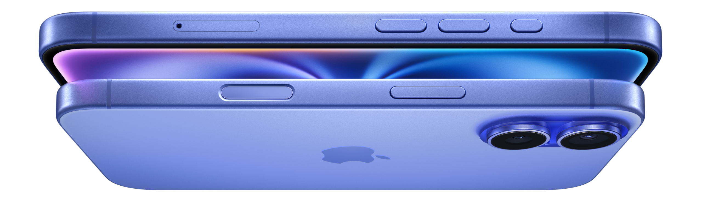
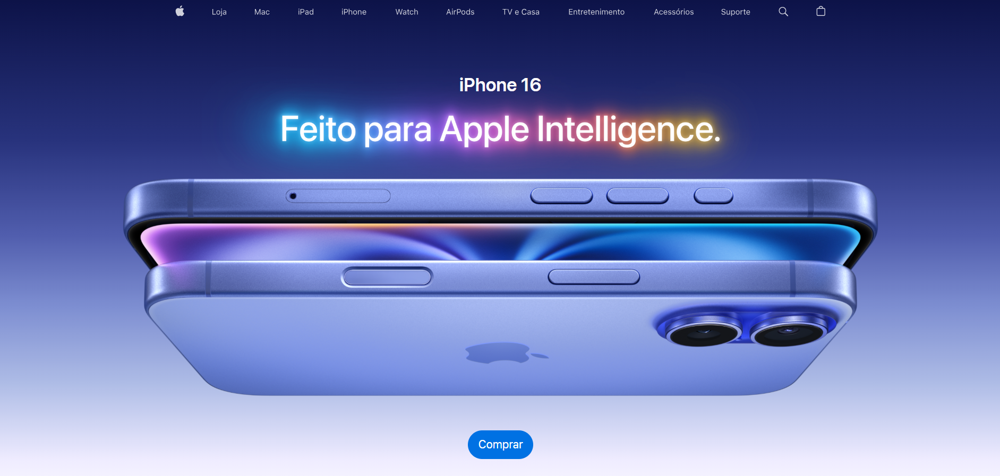

# 🍎 Recriação Estilizada da Página do iPhone 16

  

## 💡 Sobre o Projeto

Este é um projeto que recria a página oficial do **iPhone 16** da Apple com um toque autoral. O objetivo é treinar e demonstrar habilidades em **HTML**, **CSS** e **JavaScript**, aplicando interações modernas, responsividade e um visual clean inspirado na identidade da marca.

## 🚀 Funcionalidades

- 🎨 Seletor de cores interativo com troca dinâmica de imagem.
- 🖼️ Layout estilizado com gradiente de fundo e tipografia suave.
- 🛒 Botão de compra animado.
- 📱 Design responsivo e compatível com dispositivos móveis.
- 🌐 Ícones modernos com **Ionicons**.

## 🛠️ Tecnologias Utilizadas

- 
- 
- 
- 

## 📸 Preview

## 🙋‍♀️ Autora

Desenvolvido por **Laura Serbêto** – apaixonada por tecnologia, front-end e design de interfaces.

